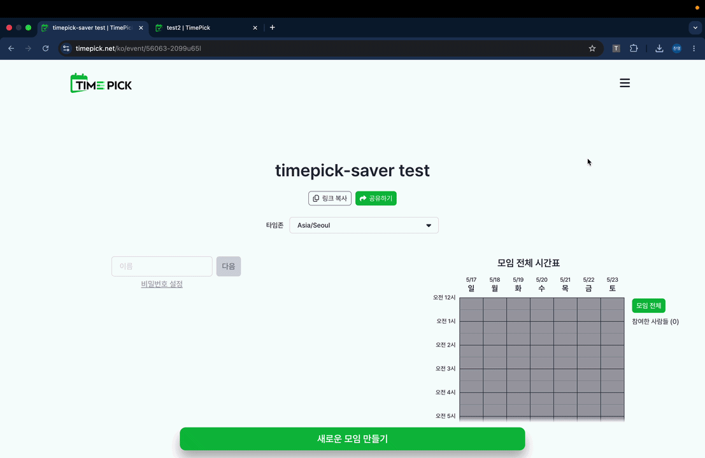

# Timepick Saver

Timepick Saver는 반복되는 시간표 입력을 자동화해 주는 크롬 확장 프로그램입니다. 매번 그룹 일정 조율을 위해 타임픽에 접속할 때마다 내 고정 스케줄(예: 알바, 수업, 출퇴근 시간 등)을 일일이 마우스로 드래그해서 채우기 번거로우셨나요?

이제 확장 프로그램 팝업창에서 내 고정 시간표를 단 한 번만 저장해 두세요. 어떤 타임픽 링크에 접속하더라도 버튼 클릭 한 번이면, 알아서 내 스케줄에 맞춰 해당되는 날짜와 시간 칸을 찾아 자동으로 칠해줍니다!

## ⚠️ 주의사항 (필독)

**자동 채우기(✨) 기능을 사용하시기 전에 반드시 아래 사항을 지켜주세요.**

1. **완전한 초기 상태에서 실행**
   - 타임픽 페이지 진입 후 **이름만 입력해 두고, 격자에는 아무 칸도 색칠되어 있지 않은 깨끗한 백지상태**에서 "자동 채우기" 버튼을 눌러주세요.
   - 만약 이미 사용자가 임의로 몇 칸을 칠해둔 상태에서 프로그램을 실행하면, 기존에 칠해져 있던 칸이 클릭되면서 지워지거나 상태가 꼬일 수 있습니다.

2. **timepick.net 전용**
   - 이 프로그램은 `timepick.net`의 스케줄 이벤트 페이지 전용으로 작동합니다. 타임픽 화면이 켜져 있는 탭에서 팝업을 열고 실행해 주세요.

---

## 🛠 설치 및 사용 방법

1. 본 저장소의 코드 폴더를 클론(Clone) 하거나 ZIP 압축 파일로 다운로드합니다.
2. 크롬 브라우저 주소창에 `chrome://extensions/` 를 입력해 확장 프로그램 관리 페이지로 이동합니다.
3. 우측 상단의 **'개발자 모드'** 토글을 켭니다.
4. 좌측 상단의 **'압축해제된 확장 프로그램을 로드합니다'** 버튼을 누르고, 다운로드한 폴더를 선택합니다.
5. 크롬 주소창 옆의 퍼즐 모양 아이콘을 눌러 `Timepick Saver`를 찾아 핀(고정) 아이콘을 눌러 빼둡니다.
6. 타임픽 사이트에 접속할 때마다 아이콘을 눌러 **[✨ 타임픽 자동 채우기]** 버튼만 누르면 스케줄 입력이 끝납니다!

